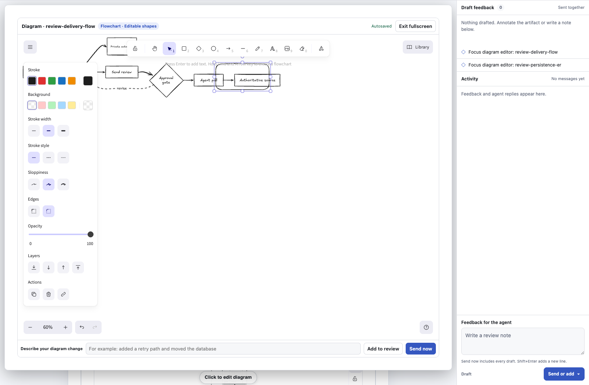
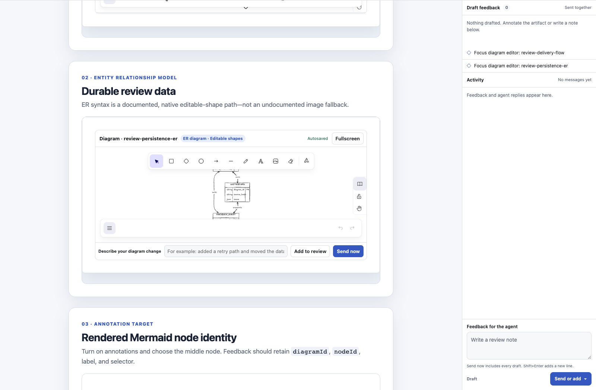

# Artifact Review

Artifact Review gives an AI coding agent a local browser review loop for the
HTML artifacts it creates. A reviewer can annotate text or elements, make
structured choices, chat, edit diagram whiteboards, and watch the artifact
reload as the agent applies feedback.

The review server is local-first, has no cloud relay, and never edits the
artifact itself. The agent remains the author of the file on disk.

## Install

Artifact Review follows the open [Agent Skills](https://agentskills.io)
directory format. Install it into the current project with the `skills` CLI:

```bash
npx skills add AhmedDaraz-Ignite/artifact-review --skill artifact-review
```

To install explicitly for both Codex and Claude Code:

```bash
npx skills add AhmedDaraz-Ignite/artifact-review \
  --skill artifact-review \
  --agent codex claude-code \
  --yes
```

Use `--global` for a user-level installation:

```bash
npx skills add AhmedDaraz-Ignite/artifact-review \
  --skill artifact-review \
  --agent codex claude-code \
  --global \
  --yes
```

A project-level install is recommended when teammates should get the same
review workflow. The nested `skills/artifact-review/` layout is intentional:
the skill, scripts, playbooks, and browser assets are installed as one
self-contained directory.

Requirements:

- Python 3.9 or newer
- A modern browser for the interactive review surface
- Node.js 22.20 or newer for installation through `npx skills`

The installed review runtime itself uses only Python's standard library and
bundled browser assets. It does not need an npm install.

## Updates

Merging a change into this repository does not update existing installations
automatically. To receive update announcements, watch the GitHub repository and
select **Custom**, then **Releases**.

After a release is published, update Artifact Review in the scope where it was
installed:

```bash
# Project installation
npx skills update artifact-review --project

# Global installation
npx skills update artifact-review --global
```

Reload the coding agent after updating so it reads the refreshed `SKILL.md`,
scripts, references, and browser assets.

Artifact Review ships one standard Agent Skills directory for every compatible
agent. It has no agent-specific updater and performs no background update
checks.

## Use from an agent

Once installed, the agent should reach for the skill on its own whenever it
proposes new work: a feature design, an implementation plan, an approach
comparison, or an idea it wants your opinion on. Instead of describing the
proposal in chat, it builds the proposal as an HTML artifact and opens it for
review, so you can annotate the parts you want changed.

You can also invoke it by name:

> Use `$artifact-review` to create or open this report for visual review, then
> apply my feedback until I approve it.

The skill instructs the agent to locate its own `SKILL.md` and run the bundled
launcher relative to that file. This matters because different agents install
skills in different directories; a global `arev` command is neither installed
nor required.

The normal loop is:

1. The agent creates or updates an HTML artifact in your project.
2. Artifact Review opens a tokenized local review URL.
3. The agent waits in a foreground long poll.
4. You add review items and select **Send now**.
5. The agent receives the batch, edits the source artifact, and replies with a
   short summary.
6. The browser live-reloads the updated file and the loop continues.

Review items may be text selections, element annotations, native form choices,
chat messages, or diagram whiteboard edits. Multiple queued items are sent as
one feedback event so related comments reach the agent together.

### Diagram review

Mermaid blocks written as `<pre class="mermaid" id="stable-id">…</pre>` gain a
lightweight **Open diagram editor** entry point. The large Excalidraw/Mermaid
runtime is not requested until the reviewer activates a diagram, and one
sandboxed editor frame moves between diagram hosts instead of mounting a copy
for every block. Use **Fullscreen** when more canvas space is useful. Edits
autosave locally after 800 ms without changing the artifact source, and the
active scene flushes before switching diagrams or reloading the artifact.

Flowchart, sequence, class, ER, and state diagrams convert to editable shapes.
Other valid Mermaid types use an explicit image-annotation fallback instead
of a blank canvas. The editor labels both modes. ER support includes entity
attributes and relationships and is built against the exactly pinned Mermaid
runtime in `package.json`.

Working scenes store the normalized Mermaid source hash. If the source changes
after an edit, Artifact Review does not merge or discard work silently: the
reviewer chooses **Re-convert (discard saved edits)** or **Keep editing saved
scene**. Submitted feedback receives an immutable scene and PNG snapshot;
working autosaves remain separate.

When an artifact already contains rendered Mermaid SVG, annotation mode targets
the exact node group. Delivered element feedback includes a constrained
`mermaid-node` target with the diagram ID, node ID, label, and selector.





## Manual CLI

For diagnostics or manual operation, first locate the installed
`artifact-review/SKILL.md`. Use the launcher next to it:

```bash
SKILL_ROOT="/absolute/path/to/artifact-review"
AREV="$SKILL_ROOT/scripts/arev"
ARTIFACT="/absolute/path/to/report.html"

"$AREV" doctor
"$AREV" open "$ARTIFACT"
"$AREV" poll "$ARTIFACT" --timeout 110
"$AREV" reply "$ARTIFACT" "Applied the requested changes."
```

On Windows, use `scripts\arev.cmd`. `ARTIFACT_REVIEW_HOME` can override the
default local state directory, `~/.artifact-review`.

Useful commands:

```text
arev doctor                  verify the installed runtime and browser assets
arev brief [PLAYBOOK ...]    print concise setup and selected guidance
arev new FILE --title TITLE  scaffold an audit-clean artifact shell
arev check FILE              audit diagrams and source coverage before opening
arev check FILE --source DOC --ignore "Section title"
arev design                  print general artifact design guidance
arev playbook                list artifact-specific playbooks
arev sessions                list known local sessions
arev export FILE [-o FILE]   create a portable single-file HTML export
arev report FILE             print a versioned JSON review report
arev report FILE --format markdown -o REVIEW.md
arev archive FILE -o REVIEW.zip
arev prune --older-than 30   preview old ended sessions
arev prune --older-than 30 --apply
arev end FILE                end the review as the agent
arev stop FILE               stop one local server
arev stop --all              stop every local Artifact Review server
```

The agent should run `poll` in the foreground. Starting repeated `open`
commands or background polling loops makes delivery state ambiguous and can
delay feedback pickup.

Default poll output is compact, single-line JSON for agent consumption. Pass
`--pretty` only when a person needs expanded output.

## Durable and reusable reviews

Each artifact session uses a private normalized SQLite store with transactional
updates, legacy JSON migration, corruption quarantine, and bounded history.
The browser initially receives only the newest 50 activity entries, loads older
entries on demand, and follows subsequent changes through compact revision
deltas. Identical diagram scenes and previews reuse SHA-256-addressed blobs.

`arev report` turns a session into stable JSON or Markdown containing artifact
and Git identity, ordered feedback and replies, delivery timestamps, and
snapshot hashes. `arev archive` writes a consistent database snapshot, JSON
report, and referenced blobs to a ZIP without copying the source artifact.

`arev prune` is a dry run unless `--apply` is present. It only removes ended,
stopped sessions older than the selected threshold, refuses symlinks or escaped
paths, and cleans unreferenced content-addressed blobs. Ending a review schedules
its local server to stop after five minutes; reopening cancels that timer.

## Runtime efficiency

Review assets are loaded once into the server's byte cache. Internal SDK,
whiteboard frame, stylesheet, and module URLs carry SHA-256 content versions;
matching URLs are immutable, gzip-compressed when useful, and support ETag
revalidation. Dynamic controller and state responses remain `no-store`.

The reproducible benchmark in `docs/skill-efficiency-audit/bench.sh` records
skill/context bytes, CLI event bytes, local readiness time, browser requests,
and whiteboard transfer size. On the recorded 2026-08-02 run, the controller
reached the diagram-ready state with zero whiteboard runtime requests; opening
one diagram created one frame and transferred the hashed runtime with gzip.
The wall-clock number is environment-specific, so use the request, frame, and
byte invariants for regressions rather than treating one machine's latency as a
universal target.

## Delivery states and latency

The review rail exposes the complete lifecycle of a feedback batch:

| State | Meaning |
| --- | --- |
| Draft | Queued in the browser but not persisted as a feedback event |
| Sending | The browser request is in flight |
| Sent | The local server durably persisted the event |
| Received | The agent's foreground poll claimed and acknowledged the event |
| Answered | The agent posted a reply after handling the event |
| Failed | Sending failed; the draft remains available to retry |

Those states separate local transport from agent turnaround:

- **Persistence transport** ends at `sent_at`.
- **Pickup latency** is `delivered_at - sent_at`.
- **Agent turnaround** is `answered_at - delivered_at` (or the subsequent
  artifact reload when measuring the visible edit).
- **End-to-end feedback time** is `answered_at - sent_at`.

`Sent` can be nearly immediate while `Received` waits for an active foreground
poll. Likewise, a fast `Received` does not imply an instant `Answered`: model
scheduling, reasoning, tool calls, and file edits happen after transport has
finished. Measure these phases separately when investigating performance.

## Remote and headless environments

For a remote development host, choose the forwarded port and browser-facing
URL before the first `open`:

```bash
"$AREV" open "$ARTIFACT" \
  --no-browser \
  --bind 0.0.0.0 \
  --port 4173 \
  --public-url "https://your-authenticated-forward.example"
```

The command prints a `SESSION` URL containing the review token. Open that URL
through an authenticated port forward supplied by your development platform.
`--public-url` only changes the URL shown to the browser; it does not create a
tunnel, TLS, authentication, or access control.

If no browser endpoint can safely reach the review server, export a portable
HTML file:

```bash
"$AREV" export "$ARTIFACT" -o "$ARTIFACT.portable.html"
```

Share the export through an approved channel and collect feedback in the normal
agent conversation. Portable export is a fallback, not a live annotation
session.

## Security

Artifact Review binds to `127.0.0.1` by default and guards controller requests
with a random session token and Host validation. The artifact runs in a
sandboxed opaque-origin iframe and does not receive that token. Treat the full
session URL as a bearer secret. The sandbox narrows access; it does not make
hostile HTML safe, so review only content you authored, generated, or otherwise
trust.

Do not expose `--bind 0.0.0.0` directly to the public internet. Use a private,
authenticated port forward and stop the session when review is finished. See
[SECURITY.md](SECURITY.md) for the threat model, safe remote operation, state
storage, exports, and vulnerability reporting.

## Development

Clone the repository, then run:

```bash
npm ci
npm run build
npm test
```

`npm run build` bundles the offline whiteboard assets, including the pinned
Mermaid converter used for ER diagrams, and regenerates third-party notices.
It embeds Excalidraw's compact fonts and uses the
browser's installed CJK fallback instead of adding Xiaolai's 12 MB shard set,
keeping the complete installable skill below 10 MB with no font network
requests. `npm test` exercises the Python server, conditional asset delivery,
browser review surface, delivery lifecycle, export path, and installation
assumptions.

Repository layout:

```text
skills/artifact-review/   the complete installable skill payload
tooling/                  asset and notice generation
tests/                    integration and browser tests
PRODUCT.md                product behavior and constraints
DESIGN.md                 interaction and visual design direction
```

Read [CONTRIBUTING.md](CONTRIBUTING.md) before submitting a change.

## License

Artifact Review is released under the [MIT License](LICENSE). Bundled
third-party components and their licenses are listed in
[THIRD_PARTY_NOTICES.txt](THIRD_PARTY_NOTICES.txt).
